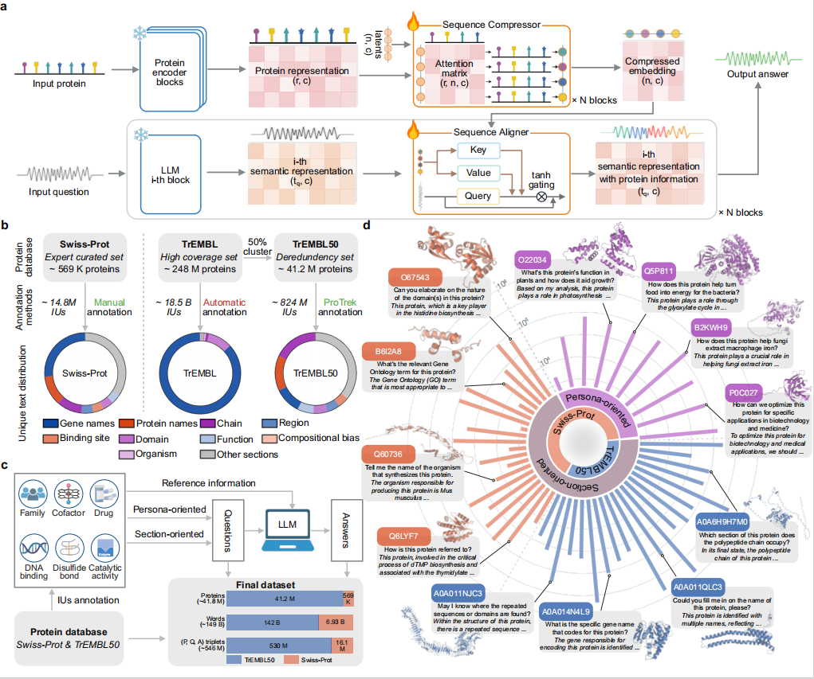

# Evolla

*a frontier protein–language generative model — because proteins deserve better small talk.*

<a href="https://doi.org/10.1101/2025.01.05.630192"></a>
<a href="https://huggingface.co/westlake-repl"></a>
<a href="https://huggingface.co/docs/transformers/model_doc/evolla"></a>
<a href="https://x.com/duguyuan/status/1876446845951492221"></a>

Decoding the molecular language of proteins — generate, predict, and (politely) interrogate sequences.

**Try it live:** [Evolla-10B chat server](http://www.chat-protein.com/) — no pip install required for curiosity.

<details open><summary><b>Table of contents</b> <em>(pick your adventure)</em></summary>

- [News](#news)
- [Overview](#overview)
- [Use Evolla with Hugging Face Transformers](#use-evolla-with-hugging-face-transformers)
- [Full setup (this repository)](#environment-installation)
- [Prepare the Evolla model](#prepare-the-evolla-model)
- [Prepare input data](#prepare-input-data)
- [Run Evolla](#run-evolla)
- [Citation](#citation)
</details>

> **Hiring:** Two PhD spots for international students at Westlake University — details [on X](https://x.com/duguyuan/status/1897101692665258245). Come help proteins find their words.

## News

- **2026/02/11** Updated the paper [Decoding the Molecular Language of Proteins with Evolla](https://doi.org/10.1101/2025.01.05.630192) with two new sections: *Inference of Eukaryotic Complexity in Asgard Archaea by Chatting with Evolla* and *Discovery of a Novel Deep-sea PET Hydrolase via Evolla*.
- **2025/07/26** Evolla was added to Hugging Face Transformers ([model documentation](https://huggingface.co/docs/transformers/model_doc/evolla)).
- **2025/04/23** [Evolla-80B](https://huggingface.co/westlake-repl/Evolla-80B) released on the Hugging Face Hub.
- **2025/03/12** [Evolla-10B-DPO](https://huggingface.co/westlake-repl/Evolla-10B-DPO) and [Evolla-10B-DPO-hf](https://huggingface.co/westlake-repl/Evolla-10B-DPO-hf) released on the Hugging Face Hub.
- **2025/02/19** [Evolla-10B-hf](https://huggingface.co/westlake-repl/Evolla-10B-hf) released on the Hugging Face Hub (Transformers-compatible weights).
- **2025/01/06** Paper drop: [Decoding the Molecular Language of Proteins with Evolla](https://doi.org/10.1101/2025.01.05.630192).
- **2024/12/06** [Evolla-10B](https://huggingface.co/westlake-repl/Evolla-10B) landed on the Hugging Face Hub (no assembly required beyond `git lfs`).

## Overview

<figure>
  
  <figcaption><em>Overview of Evolla.</em></figcaption>
</figure>

## Use Evolla with Hugging Face Transformers

**API reference & examples:** [Evolla in Hugging Face Transformers](https://huggingface.co/docs/transformers/model_doc/evolla) (`EvollaProcessor`, `EvollaForProteinText2Text`, configs, and tips such as matching `aa_seq` / `foldseek` length).

For checkpoints with **Hugging Face support** ([Evolla-10B-hf](https://huggingface.co/westlake-repl/Evolla-10B-hf), [Evolla-10B-DPO-hf](https://huggingface.co/westlake-repl/Evolla-10B-DPO-hf)), you can load Evolla like any other Hub model: install **PyTorch** and a **Transformers** release that includes `EvollaProcessor` and `EvollaForProteinText2Text`, then `from_pretrained` the model id.

You **do not** need to clone this repository, run `environment.sh`, or download the SaProt / Llama checkpoints in the sections below—the Hub weights match the Transformers API.

```python
from transformers import EvollaProcessor, EvollaForProteinText2Text

model_id = "westlake-repl/Evolla-10B-hf"
processor = EvollaProcessor.from_pretrained(model_id)
model = EvollaForProteinText2Text.from_pretrained(
    model_id,
    device_map="auto",
).eval()

# Build protein_informations (aa_seq, foldseek) and chat messages, then:
# inputs = processor(protein_informations, messages_list, return_tensors="pt").to(model.device)
# outputs = model.generate(**inputs)
```

Adjust `device_map`, dtype, and generation settings for your hardware. For TSV-style batch inference inside a checkout of this repo, see `scripts/inference_hf.py` (multi-GPU uses `torch.distributed`).

---

**Full setup (this repository):** from [Environment installation](#environment-installation) through [Run Evolla](#run-evolla) describes the stack maintained here—conda env + `environment.sh`, local clones of Evolla-10B **non**-hf weights plus SaProt and Llama, and `scripts/inference.py`.

## Environment installation

### Create a virtual environment

```bash
conda create -n Evolla python=3.10
conda activate Evolla
```

### Install packages

```bash
bash environment.sh
```

## Prepare the Evolla model

Pre-trained Evolla-10B lives on the Hugging Face Hub. Clone the checkpoints (grab coffee if the network is shy):

```bash
cd ckpt/huggingface

git lfs install

git clone https://huggingface.co/westlake-repl/Evolla-10B

git clone https://huggingface.co/westlake-repl/SaProt_650M_AF2

git clone https://huggingface.co/meta-llama/Meta-Llama-3-8B-Instruct
```

### Model checkpoints

All rows are Hugging Face Hub repos. Names ending in **`‑hf`** ship the Transformers-compatible layout (`EvollaProcessor` / `EvollaForProteinText2Text`; see the [model documentation](https://huggingface.co/docs/transformers/model_doc/evolla)). The rest are the original checkpoints used with this repo’s stack—clone them alongside SaProt and Llama as above, then run `scripts/inference.py`.

| **Checkpoint** | **Params** | **Training objective** | **`transformers`-compatible** |
| --- | ---: | --- | :---: |
| <a href="https://huggingface.co/westlake-repl/Evolla-10B"></a> | 10B | Causal protein–language modeling (CPLM) | — |
| <a href="https://huggingface.co/westlake-repl/Evolla-10B-hf"></a> | 10B | Causal protein–language modeling (CPLM) | ✓ |
| <a href="https://huggingface.co/westlake-repl/Evolla-10B-DPO"></a> | 10B | Direct preference optimization (DPO) | — |
| <a href="https://huggingface.co/westlake-repl/Evolla-10B-DPO-hf"></a> | 10B | Direct preference optimization (DPO) | ✓ |
| <a href="https://huggingface.co/westlake-repl/Evolla-80B"></a> | 80B | Causal protein–language modeling (CPLM) | — |

## Prepare input data

Evolla batch inference expects a TSV like `examples/inputs.tsv`. To build it from **structures** (PDB or mmCIF) instead of hand-writing sequences:

1. **Foldseek** — Install a working [`foldseek`](https://github.com/steineggerlab/foldseek/releases) binary and pass its path to the helper script (default in the script is only an example; use your own install).
2. **Structures** — Put the chains you care about in one directory per batch (`.pdb` / `.cif` files).
3. **Questions** — Supply prompts with repeated `--question "..."` and/or a `--questions-file` with one question per line (blank lines ignored). You can combine both.

**Multiple questions → Cartesian product.** `get_input_files.py` writes one row per (structure file, question) pair. If you have *m* questions and *n* proteins (structure files) in a directory, the generated TSV has *m*×*n* lines—every question is paired with every structure.

From the repo root, generate a TSV (see `python scripts/get_input_files.py --help` for all flags):

```bash
PYTHONPATH=. python scripts/get_input_files.py \
  --foldseek /path/to/foldseek \
  --structure-result path/to/structures_dir path/to/output.tsv \
  --question "What is the catalytic activity of this protein?"
```

Use `--rewrite` to overwrite an existing output file. Repeat `--structure-result DIR OUT.tsv` for multiple directory → output pairs.

### TSV format

Each row is tab-separated: `(protein_id, aa_sequence, foldseek_sequence, question_in_json_string)`.

| Column | Meaning |
| --- | --- |
| `protein_id` | Row id |
| `aa_sequence` | Amino acid sequence |
| `foldseek_sequence` | Same chain in FoldSeek format |
| `question_in_json_string` | Question, serialized with `json.dumps` |

## Run Evolla

### Use `inference.py` (default stack in this repo)

Runs the project config and **non-`hf`** checkpoints prepared above. From the repo root — swap `/your/path/to/Evolla` for your clone:

```bash
cd /your/path/to/Evolla
python scripts/inference.py --config_path config/Evolla_10B.yaml --input_path examples/inputs.tsv
```

### Use `inference_hf.py` (Transformers / `-hf` weights)

If you cloned the repo but want **Hub `Evolla-*-hf`** models via `EvollaForProteinText2Text`, use `scripts/inference_hf.py` for TSV batching (see `--help`; the script uses `torch.distributed`—launch accordingly for your GPU layout).

## Citation

If this repo saved you a weekend, please cite:

```bibtex
@article{zhou2025decoding,
  title={Decoding the Molecular Language of Proteins with Evolla},
  author={Zhou, Xibin and Han, Chenchen and Zhang, Yingqi and Su, Jin and Zhuang, Kai and Jiang, Shiyu and Yuan, Zichen and Zheng, Wei and Dai, Fengyuan and Zhou, Yuyang and others},
  journal={bioRxiv},
  pages={2025--01},
  year={2025},
  publisher={Cold Spring Harbor Laboratory}
}
```

### Other resources

- [ProTrek](https://www.nature.com/articles/s41587-025-02836-0) (*Nature Biotechnology*) — [server](http://search-protrek.com/)
- [Pinal](https://doi.org/10.1101/2024.08.01.606258) — [server](http://www.denovo-pinal.com/)
- [SaprotHub](https://www.nature.com/articles/s41587-025-02859-7) (*Nature Biotechnology*) — [Colab](https://colab.research.google.com/github/westlake-repl/SaprotHub/blob/main/colab/SaprotHub_v2.ipynb?hl=en)
