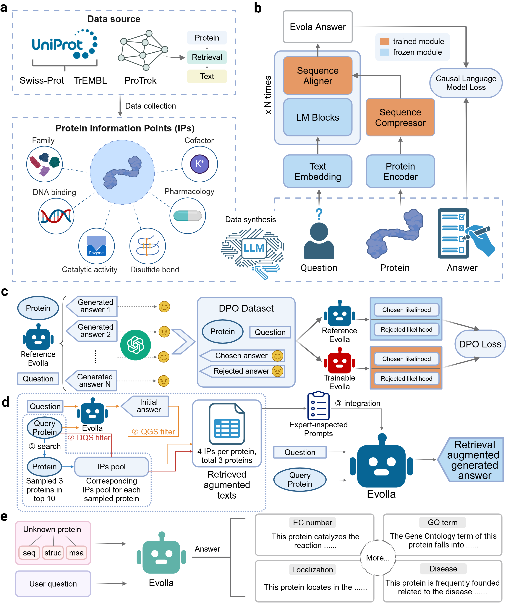

# Evolla

<a href="https://doi.org/10.1101/2025.01.05.630192"></a>
<a href="https://huggingface.co/westlake-repl/Evolla-10B"></a>
<a href="https://x.com/duguyuan/status/1876446845951492221"></a>

A frontier protein-language generative model designed to decode the molecular language of proteins.

*Quickly try our online server (Evolla-10B) [here](http://www.chat-protein.com/).*

<details open><summary><b>Table of contents</b></summary>

- [News](#News)
- [Overview](#Overview)
- [Enviroment installation](#Enviroment-installation)
- [Prepare the Evolla model](#Prepare-the-Evolla-model)
- [Prepare input data](#Prepare-input-data)
- [Run Evolla](#Run-Evolla)
- [Citation](#Citation)
</details>

> We have 2 PhD positions for international students at Westlake University, China! see [here](https://x.com/duguyuan/status/1897101692665258245).
> 
## News
- **2025/01/06** We released our paper [Decoding the Molecular Language of Proteins with Evolla](https://doi.org/10.1101/2025.01.05.630192).
- **2024/12/06** We uploaded the [Evolla-10B model](https://huggingface.co/westlake-repl/Evolla-10B) to `huggingface hub`.
## Overview



## Enviroment installation

### Create a virtual environment
```
conda create -n Evolla python=3.10
conda activate Evolla
```

### Install packages
```
bash environment.sh
```

## Prepare the Evolla model

We provide the pre-trained Evolla-10B model in `huggingface hub`. You can download the model by running the following command:
```
cd ckpt/huggingface

git lfs install

git clone https://huggingface.co/westlake-repl/Evolla-10B

git clone https://huggingface.co/westlake-repl/SaProt_650M_AF2

git clone https://huggingface.co/meta-llama/Meta-Llama-3-8B-Instruct
```

### Model checkpoints

|**Name** |**Size** |
|---------|---------|
|[Evolla-10B](https://huggingface.co/westlake-repl/Evolla-10B) | 10B |

## Prepare input data

We provide a sample input file `examples/inputs.tsv` for you to test the Evolla model. The input file should be a tab-separated file, where each line represents `(protein_id, aa_sequence, foldseek_sequence, question_in_json_string)`.

Note: `protein_id` is the identifier of the line, `aa_sequence` is the amino acid sequence of the protein, `foldseek_sequence` is the sequence of the protein in FoldSeek format. `question_in_json_string` is the question which is dumped by `json.dumps` function.


## Run Evolla

### Use `inference.py`

The following provides script to run inference based on tsv file.

You should replace the `/your/path/to/Evolla` to your own path to `Evolla` directory.

```
cd /your/path/to/Evolla
python scripts/inference.py --config_path config/Evolla_10B.yaml --input_path examples/inputs.tsv
```

## Citation

If you find this repository useful, please cite our paper:

```
@article{zhou2025decoding,
  title={Decoding the Molecular Language of Proteins with Evolla},
  author={Zhou, Xibin and Han, Chenchen and Zhang, Yingqi and Su, Jin and Zhuang, Kai and Jiang, Shiyu and Yuan, Zichen and Zheng, Wei and Dai, Fengyuan and Zhou, Yuyang and others},
  journal={bioRxiv},
  pages={2025--01},
  year={2025},
  publisher={Cold Spring Harbor Laboratory}
}
```
### Other resources

- [ProTrek](https://www.biorxiv.org/content/10.1101/2024.05.30.596740v2) and its [online server](http://search-protrek.com/)
- [Pinal](https://www.biorxiv.org/content/10.1101/2024.08.01.606258v2) and its [online server](http://www.denovo-pinal.com/)
- [SaprotHub](https://www.biorxiv.org/content/10.1101/2024.05.24.595648v5) and its [online server](https://colab.research.google.com/github/westlake-repl/SaprotHub/blob/main/colab/SaprotHub_v2.ipynb?hl=en)
